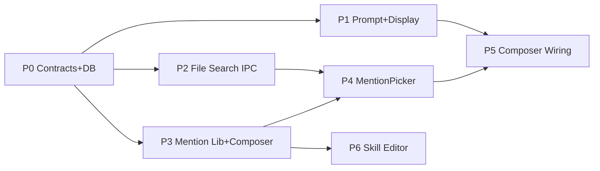

# At-Mention Context System Implementation Plans

Last updated: 2026-04-23

This docs package is the implementation source of truth for the Orbyt `@`-mention context system rollout.

The feature lets a user type `@` in the chat composer (and the skill editor) to attach structured context to a turn: today `@assignment` for Canvas assignments and `@file` for workspace or local files. Mentions are late-bound: the turn carries only a stable reference, and Codex's existing MCP tools resolve the content at tool-call time.

## How To Use These Plans

1. Start with [GLOSSARY.md](GLOSSARY.md) to see current status, shared vocabulary, and the handoff record.
2. Work phases in order unless a later phase explicitly says it can start in parallel.
3. Before coding a phase, read that phase's Orientation Note and follow the required Beginning -> Middle -> End flow from [PLAN.md](../../../PLAN.md).
4. Every phase executes through a vertical tracer-bullet TDD loop per [.agents/skills/tdd/SKILL.md](../../../.agents/skills/tdd/SKILL.md). Do not batch tests horizontally.
5. Do not mark a phase complete until its verification gates are green and its handoff notes are recorded in [GLOSSARY.md](GLOSSARY.md).

## Phase Order

- [Phase 00 - Reference Contracts And Persistence](phase-00-reference-contracts-and-persistence.md)
- [Phase 01 - Prompt And Display Serialization](phase-01-prompt-and-display-serialization.md)
- [Phase 02 - Workspace File Search IPC](phase-02-workspace-file-search-ipc.md)
- [Phase 03 - Mention Lib And Composer @ Trigger](phase-03-mention-lib-and-composer-at-trigger.md)
- [Phase 04 - MentionPicker UI](phase-04-mention-picker-ui.md)
- [Phase 05 - Chat Composer Wiring](phase-05-chat-composer-wiring.md)
- [Phase 06 - Skill Editor Mentions](phase-06-skill-editor-mentions.md)

## Dependency Graph

Phase 02 and Phase 03 can run in parallel once Phase 00 lands. Everything else is sequential.

## Planning Principles For This Rollout

- Each phase adds exactly one class of responsibility.
- Each phase is independently verifiable with automated checks and one short manual smoke.
- Mentions are late-bound: ship only a reference, let Codex resolve content via existing MCP tools.
- `@file` reuses the existing `TurnAttachmentInput` pipeline. `@assignment` uses a new sibling `TurnReferenceInput` type so filesystem invariants stay clean.
- Skill-editor mentions are literal in v1 (bound to a specific Canvas assignment ID at author time). Slot / template mentions are deferred.
- Serialization is plain markdown links so saved `SKILL.md` files remain portable and Codex parses them natively.

## Deliverables Across The Full Rollout

- `TurnReferenceInput` / `OrchestrationTurnReference` contracts and persistence
- Prompt serialization that Codex can read for references alongside attachments
- Workspace file search IPC for Cursor-style `@file` fuzzy matching
- `RichComposer` `@` trigger with kind-aware chips and markdown round-trip
- `MentionPicker` dropdown with Assignments + Files sections and permissions-aware states
- End-to-end wiring from composer to `sendTurn`
- Skill editor replacement with mention-aware editing and stable markdown round-trip

## Out Of Scope For v1

`@course`, `@page`, `@canvas-file`, `@thread`, `@memory`, `@web`, notepads, slot/template mentions in skills. The `TurnReferenceKind` schema is shaped so future kinds drop in without a second migration.
